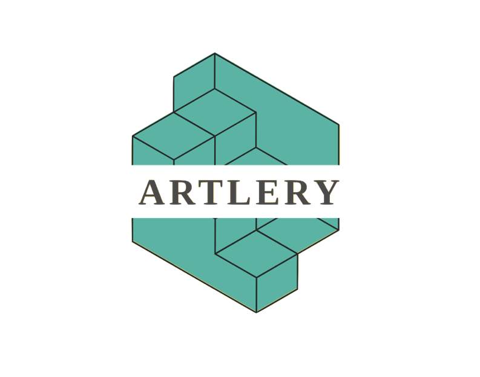

<!-- PROJECT LOGO -->
<br />
<div align="center">
  

<h3 align="center">Artlery - AI Generated Art Gallery with Music</h3>

  <p align="center">
    BU CAS CS 411 Software Engineering Project

    -Team 4-
    David Euijoon Kim
    Jaimey Frank
    Janna Foy
    Victoria Boulin
    
  </p>
</div>


<!-- ABOUT THE PROJECT -->
## About The Project

[](src/assets/Demo_Video.mov)

This is a MEAN stack project for a software engineering course at Boston University.
After logging in to your google account, you can create a new art by typing in keywords such as `An astronaut riding a horse on Mars.`
Once you submit the keywords, the application will generate an image and an audio related to the keywords.
You can save your favorite artworks into your own art gallery linked to your Google account.

API Used:
* Stable Diffusion AI - Text to Image Generation Model from Replicate 
* Riffusion AI - Text to Image to Audio Generation Model from Replicate
* Google OAuth - Login with your Google Account


### Built With

* [](https://mongodb.com) MongoDB
* [](https://expressjs.com) ExpressJS
* [](https://angular.io) Angular
* [](https://nodejs.org) NodeJS


<!-- GETTING STARTED -->
## Getting Started

To run the application please follow these simple steps.

### Prerequisites

* npm
  ```sh
  npm install npm@latest -g
  ```
  
* Alternative: yarn
  ```sh
  npm install --global yarn
  ```

### Installation

1. Get a free API Key at [https://replicate.com](https://replicate.com)
    and [https://mongodb.com](https://mongodb.com)
    and [https://console.cloud.google.com](https://console.cloud.google.com)
2. Clone the repo
   ```sh
   git clone https://github.com/BU-CS411-Team4/ArtGallery.git
   ```
3. Install NPM packages
   ```sh
   npm install
   ```
   or
4. ```sh
   yarn install
   ```
4. Enter your API KEY in `Application/.env` *Require creation of .env file
   ```.dotenv
   REPLICATE_API_TOKEN = 'ENTER YOUR API KEY';
   MONGODB_API_TOKEN = 'ENTER YOUR API KEY';
   GOOGLE_CLIENT_ID = 'ENTER YOUR API KEY';
   GOOGLE_CLIENT_SECRET = 'ENTER YOUR API KEY';
   ```

<p align="right">(<a href="#readme-top">back to top</a>)</p>


<!-- USAGE EXAMPLES -->
## Run
1. Locate your terminal to `Application`
2. Run `ng serve` for a dev server. Navigate to `http://localhost:4200/`. The application will automatically reload if you change any of the source files.
3. Locate a new terminal to `Application`
4. Run `npx nodemon index.js` to activate the backend server.

<p align="right">(<a href="#readme-top">back to top</a>)</p>

<!-- LICENSE -->
## License

Distributed under the MIT License. See `LICENSE.txt` for more information.

<p align="right">(<a href="#readme-top">back to top</a>)</p>
